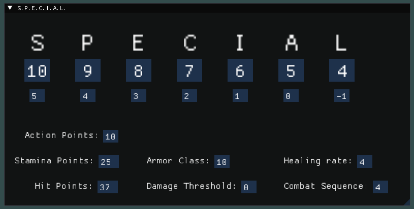

# Fallout_Character_Manager
A digital character sheet for the [Fallout TTRPG](https://docs.google.com/document/d/1mjhbjCLrqe7kXjxWgTfMIoh_pArHUIKW8HdEWpAv90I/edit?usp=sharing) made by [XP to Level 3](https://www.youtube.com/@XPtoLevel3)

My friends and I started a campaign but I found tracking resources a bit too hard, especially when I tried generating NPCs with interesting equipment and loot. This started as a Random NPC generator but I later saw the potential to turn the application into a tool which can assist players and DMs alike.

I plan to expand upon this project in my free time and I will try to implement feature requests.

This repo is open-source in case you're a fellow C++ enjoyer and want to build on top of the project. The code is a hot mess at places but you are more than welcomed to download the .zip and change it up as much as you want.

If you find any bugs, feel free to create an issue on this github page and I will try to address it as soon as possible. :)

Huge thanks to [ocornut](https://github.com/ocornut) for developing [ImGui](https://github.com/ocornut/imgui) - a wonderful bloat-free UI library.

# How to Use

This section briefly explains what is the role of each field and what they affect. Also some useful do's and don'ts.

## General Remarks

 - The Character Manager doesn't play nice with things that have the same name. For example two perks named both `"Pain Train"` or two weapons both named `"Commie Whacker"`. It shouldn't lead to any crashes but it is a bit annoying to deal with and you can lose information. Keep names unique in order to avoid headaches.

 - **Power Armor** is not included yet.

## Menu Bar

### File

 - **File name** is the folder where it will try to extract character information from. If you want to switch up character sheets on runtime, you need to type in the exact name of the folder (I plan to make it more user-friendly). 
 - **Save** will store your character information based on your character's *Name* (not file name);
 - **Load** will load up character based on *File Name*.
 - **Default** is a WIP and doesn't do anything right now.

Keep in mind that the app will autosave your character when you close it and will autoload the character which was opened the last time the application was running.

### CharacterSheet

 - **Show Manual Modifiers** is a checkbox option which allows the player to tweak some values manually. This is particularly good the character consumes a certain `food` or `chem` and needs to temporarily adjust their stats. It is also useful for adding `skill points` from leveling.

 ### Style

 - **Style** does UI color magic. See for yourself. :)

## Character Bio Window

**Name** field is responsible for creating your character folder in *Fallout_Character_Manager/characters/*. Because of that, it will throw an error if you use non-Latin alphabet or special symbols like `\ / : * ? " < > |`. Everything else should be fine. If not, let me know.

**Race** affects healing rate if you select a `Robot` or a `Synth` and carry load if you select `Super Mutant` or `Nightkin`.

**Background** is only for flavour, doesn't serve a function.

**Level** affects HP and SP.

## S.P.E.C.I.A.L. Window

**SPECIAL** values are capped between 1 and 15 (just in case).

**SPECIAL modifiers** are calculated automatically based on the **SPECIAL** and are read-only.

**Action Points** are automatically calculated based on *Agility* and have a *manual modifier*.

**Stamina Points** and **Hit Points** are automatically calculated based on *Level* and have *manual modifiers*.

**Armor Class** and **Damage Threshold** are automatically calculated based on the equipped *Armor* and have *manual modifiers*.

**Healing Rate** is calcualted based on *Endurance* (or *Intelligence* for robots and synths) and has a *manual modifier*.

**Combat Sequence** is calcualted based on *Perception* and has a *manual modifier*.

Manual modifiers for these fields are not saved upon exit. If you will need them for more than 1 session, I recommend making a note in the *Perks/Traits* Window or in the  *Junk* tab in the *Inventory* Window.

## Skills Window

 - All skills are calculated based on their corresponding *SPECIAL* values. If a skill scales with 2 different abilities, it chooses the higher one.

 - A **Tag!** can be applied to all skills, adding +2 to it.

 - All skills have a *manual modifier*. These modifiers are saved upon exiting the app.

## Traits and Perks Window

You can **Add** perks or traits and view them in this window. When you type the perk's name, you must click `Enter` in order to save it. This will collapse the header and you have to open it again to enter the description. 

You can also **Delete** perks or traits. Click the button and confirm your action.

And don't forget to keep the names unique! :)

## Survival Window

**Rad DC** is calculated based on *Endurance* and has a *manual modifier* which is not saved upon exit.

**Rads**, **Fatigue**, **Thirst**, **Hunger** and **Exhaustion** are all just simple input fields which help you track your character's well-being.

## Passives Window

**Passive Sense** is calcualted based on *Perception* and has a *manual modifier* which is not saved upon exit.

**Party Nerve**, **Party Luck**, **Party Sneak** are all just simple input fields which help you track your abilities as a team!

## Limb Conditions Window

 - You can add inflicted limb conditions from the **Add Condition** drop-down menu. Conditions are unique, you can't stack 100 `Leg 2`'s.
 - If you cure the condition, you can always **Remove** it.

## Armor and Weapons Window

Here, you can view all of your *Armor* and *Weapons* and equip/unequip them. You can also view their *Upgrades* and *Properties*.

You can also rename a weapon which is really useful since it is preferable that names are kept unique.

## Inventory Window

**Carry Load** is automatically calculated so you can focus on more important things like *hackin', whackin' and choppin' that meat*.

**Carry Capacity** is also automatically calculated and it has a *manual modifier* which is saved upon exit.

**Caps** is a simple input field, you can type in whatever number you want.

Your loot is organized in multiple categories. Every item has an `Amount` parameter which you can adjust. 

Need to free up some space? You can always delete an item by *right-clicking* it.

## Catalogue Window

The catalogue window contains everything from almost every table in the System's [doc](https://docs.google.com/document/d/1mjhbjCLrqe7kXjxWgTfMIoh_pArHUIKW8HdEWpAv90I/edit?usp=sharing). Should you need to add an item to your inventory or quickly check what `Level 3 Decay` does to your weapon, you can easily do so through here.

Adding stuff requires you to *right-click* the item and click **Add**.

The Wasteland is a vast world which cannot be contained by spreadsheets! Sometimes, you may need to add a custom item to your inventory. The app allows you to do that and it will classify this piece of treasure it as `Junk`.

Remember to keep the names unique! If you need more of the same junk, use the `Amount` field in the *Inventory Window*.

## Info Window

This window displays all information of your currently selected item, no matter if it's from the *Catalogue* or your *Inventory*.

The only exceptions are the *Armors* and *Weapons* in your character's possession since you can already see all of their info in the *Equippable Item Window*.